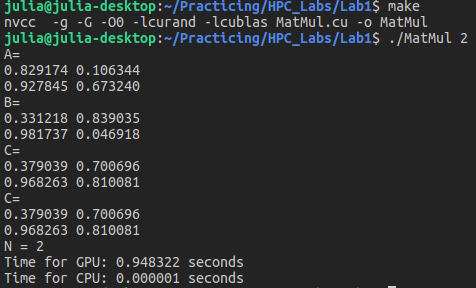

# Лабораторная работа №1 
### Задание
Перемножение матриц.  
Задача: реализовать алгоритм перемножения матриц  
Язык: C++ или Python  
Входные данные: 2 матрицы размером от 100х100 до 2000х2000 каждая  
Выходные данные: проверка корректности перемножения + время вычисления  
Реализация должна содержать 2 функции перемножения матриц: на CPU и на GPU с
применением CUDA.  
### Аппаратная база
Работа выполнена с использованием Jetson Nano B01.  
Processor: ARMv8 Processor rev 1 (v8l) x 4  
Graphics: NVIDIA Tegra X1 (nvgpu)/integrated  
### Описание программы
Программа осуществляет умножение квадратных матриц размерностей N×N, сгенерированных случайно.  
Функция gpu_fill_rand() использует возможности библиотеки CURAND и заполняет матрицы случайными числами прямо на девайсе. Эти матрицы затем копируются на хост, чтобы вычислить произведение в последовательном режиме на хосте. Но если бы этого, например, не требовалось, CURAND позволил бы сильно сократить время на пересылку данных с хоста на девайс.  
Функция ядра gpu_blas_mmul() использует функцию библиотеки CUBLAS cublasSgemm() для перемножения матриц. CUBLAS сама выбирает оптимальное количество блоков и нитей для решения задачи, поэтому их не нужно рассчитывать самостоятельно в коде.   
Функция conseq_mmul() осуществляет алгоритм перемножения матриц в последовательном режиме на хосте.  
Для компиляции использовался Makefile, которой запускается с помощью команды make из одной директории с файлом программы. Далее размерность массивов указывается при запуске исполняемого файла.  
Проверка корректности перемножения была сделана на основе вывода решения для матриц с размерностью N=2. Результат для поверки показан на рисунке снизу.  

Было опробовано засечь время выполнения функции ядра с учетом и без учета пересылки результата с девайса обратно на хост. Результирующее время вышло одинаковым, поэтому в итоге время засекалось с учетом пересылки данных.
### Экспериментальное исследование
В таблице представлены результаты исследования времени работы параллельной и последовательной функций для различных размерностей массива. Значение времени было взято как среднее по 10 запускам.  

Размерность матрицы, N | Время работы функции на GPU, мс | Время работы функции на CPU, мс | CPU/GPU
:----:|:-------:|:-----------:|------:
128 | 892,078 | 45,376 | 0,050
256 | 823,672| 400,066 | 0,485
512 | 880,910 | 3733,903 | 4,238
1024 | 954,268 | 88143,503 | 92,367
2000 | 997,922 | 182086,156 | 182,465

Исследование показало, что время работы части программы, исполняющейся на GPU, очень мало растет с увеличением N и имеет большее время выполнения для маленькой размерности, чем последовательный вариант. Для N=512 параллельная программа становится в 4 раза быстрее. Таким образом, зависимость ускорения от размерности матрицы выше линейной и программа на CUDA дает существенный выигрыш во времени для размерностей матриц >512. Однако, для меньших матриц последовательный алгоритм выигрывает по скорости.  
