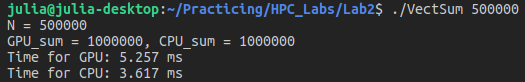

# Лабораторная работа №2 
### Задание
Сумма элементов вектора.  
Задача: реализовать алгоритм сложения элементов вектора  
Язык: C++ или Python   
Входные данные: Вектор размером 1 000..1 000 000 значений  
Выходные данные: сумма элементов вектора + время вычисления  
Реализация должна содержать 2 функции сложения элементов вектора: на CPU и на GPU с
применением CUDA.  
### Аппаратная база
Работа выполнена с использованием Jetson Nano B01.  
Processor: ARMv8 Processor rev 1 (v8l) x 4  
Graphics: NVIDIA Tegra X1 (nvgpu)/integrated  
### Описание программы
Функция ядра addKernel() реализует алгоритм параллельной редукции. Этот же код применим к любому другому коммутативному ассоциативному оператору, например, к умножению. Используется только один блок с максимальным количеством нитей (1024). При использовании меньшего числа нитей, время работы программы увеличивается в несколько раз. Промежуточные вычисления сохраняются в shared памяти одного блока внутри массива cache[], и финальная сумма собирается в его нулевом элементе. Так как физически параллельно исполняются нити только одного варпа, для устранения состояния гонки в использовании shared памяти между потоками используется барьер __syncthreads(). На самом деле, сначала, когда элементов вектора больше, чем потоков, мы складываем их независимо с шагом, равным blockDim.x. Фактическая параллельная редукция начинается тогда, когда число элементов становится равным blockDim.x. Далее, когда число элементов становится равно числу нитей в варпе, нецелесообразно продолжать использовать тот же цикл с __syncthreads() и условием if(global_thread_index < size_of_vector). Поэтому применяется функция singleWarp().  
Функция conseq_add() осуществляет сложение элементов вектора в последовательном режиме на хосте.  
Для компиляции использовался Makefile, которой запускается с помощью команды make из одной директории с файлом программы. Далее размерность вектора указывается при запуске объектного файла.  
Проверка корректности сложения была сделана на основе вывода решения для вектора размерностью N = 500000, *заполненного двойками*. Результат для поверки показан на рисунке снизу.  

### Экспериментальное исследование
В таблице представлены результаты исследования времени работы параллельной и последовательной функций для различных размерностей вектора. Для времени было взято среднее значение по 10 запускам. 

Размерность вектора, N | Время работы функции на GPU, мс | Время работы функции на CPU, мс | CPU/GPU
:----:|:-------:|:-----------:|------:
1000 | 0,339 | 0,007 | 0,020
10000 | 0,380| 0,065 | 0,171
100000 | 0,873 | 0,707 | 0,809
500000 | 4,376 | 3,582 | 0,818
1000000 | 7,622 | 7,165 | 0,940
2000000 | 50,713 | 137,191 | 2,587
5000000 | 126,191 | 334,802 | 2,653
Исследование показало, что время работы функций и хоста, и девайса, растет достаточно сильно с увеличением размерности вектора, и при N < 20000 последовательная функция быстрее. Это происходит потому, что вызывается всего один блок нитей, время тратится на их синхронизацию и проверку условий в цикле. При б*о*льших N программа на CUDA уже начинает давать выигрыш во времени в 2,5 раза.
